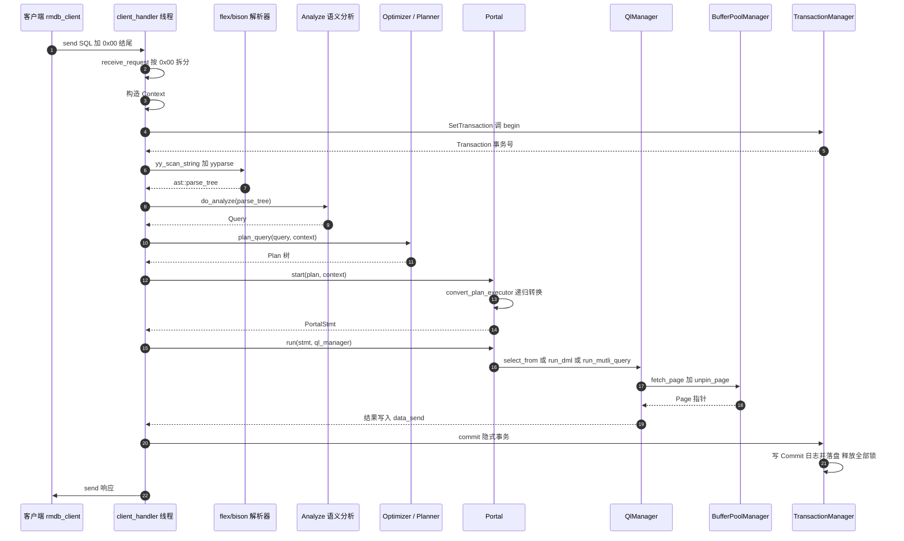
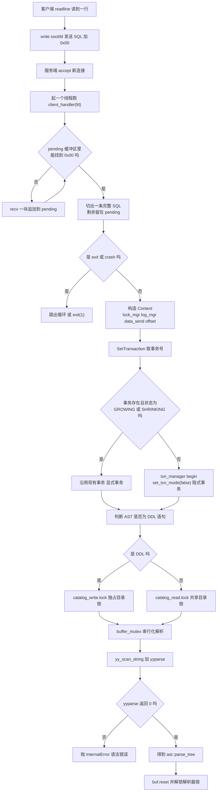
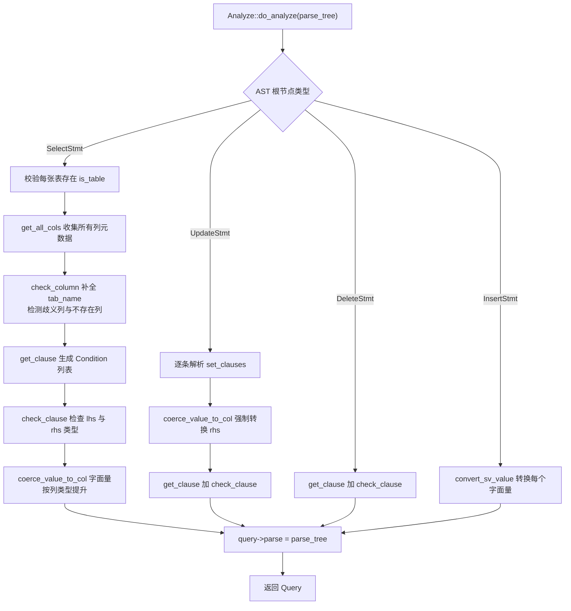
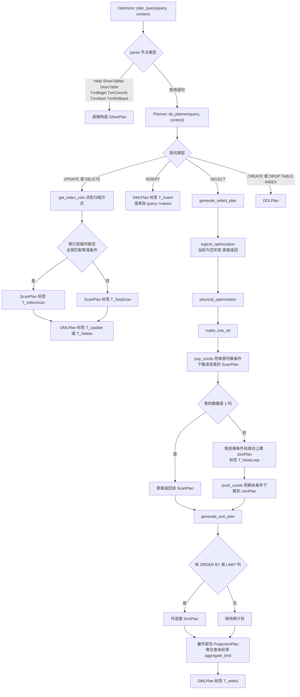
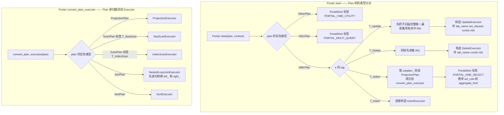
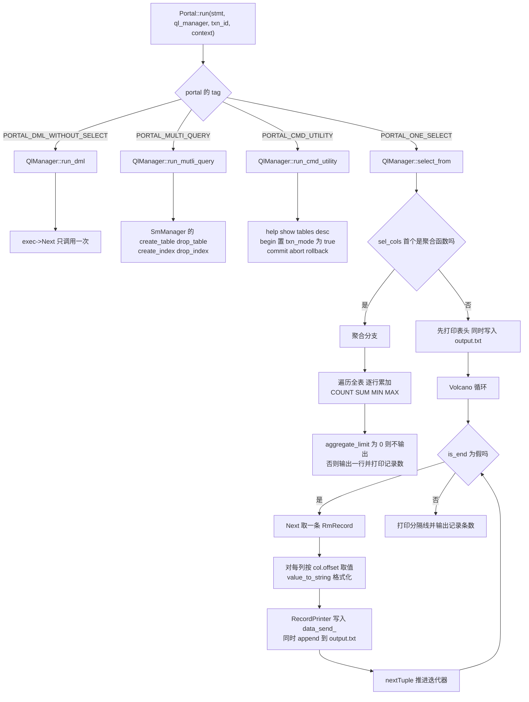
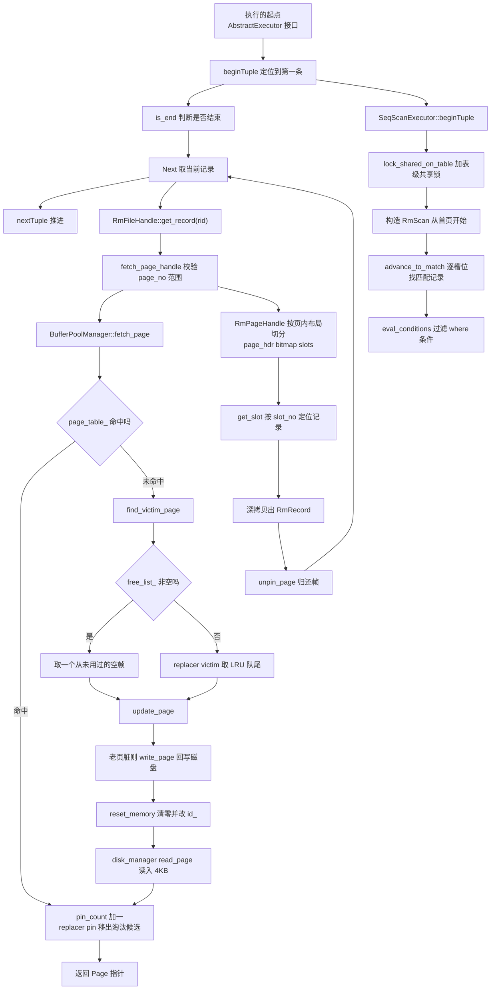
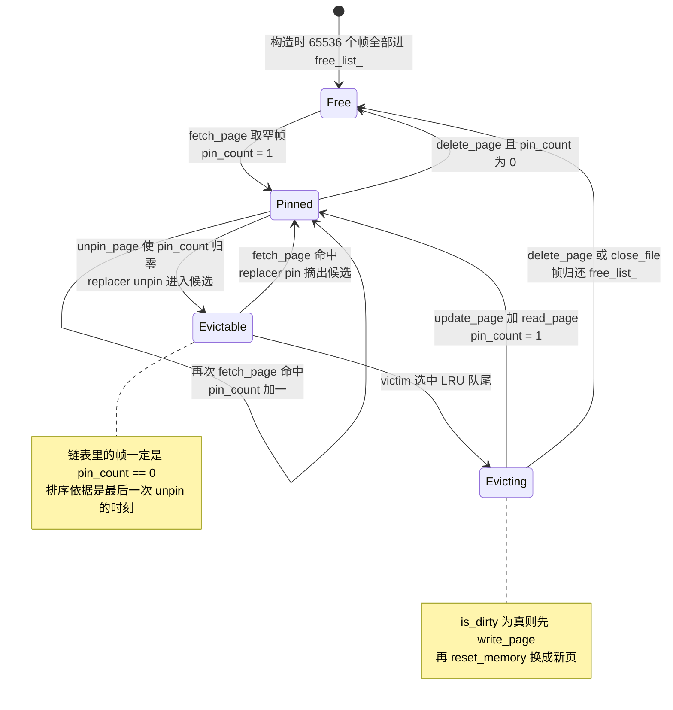
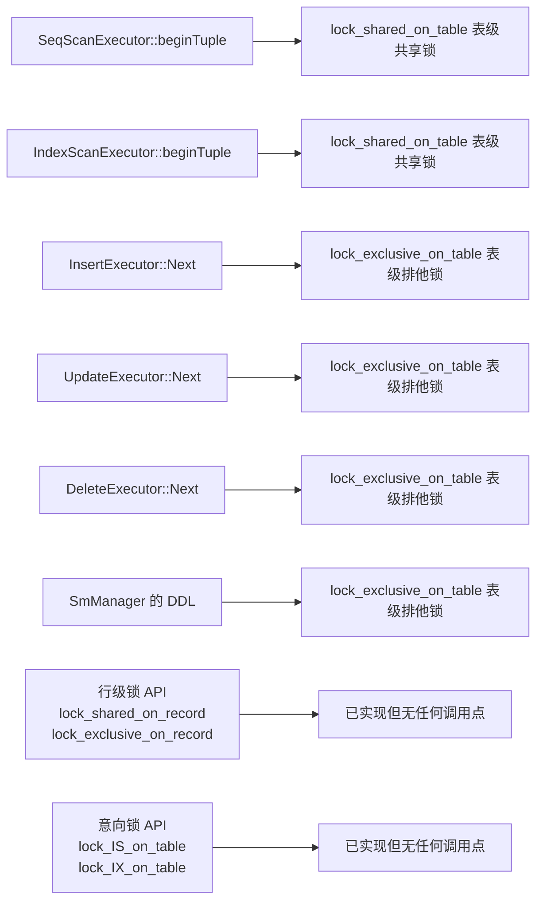
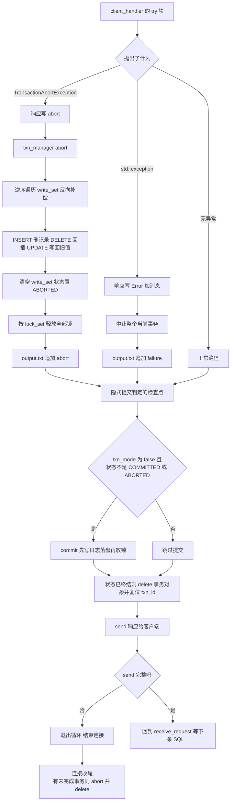

# RMDB：一条 SQL 的完整函数流程图

> 本文按**层次分类**画出从客户端发出 SQL 到结果回包的完整函数调用链。
> 所有节点都对应仓库当前 main 分支的真实代码，标了函数名与文件。
> 图形使用 Mermaid 书写，GitHub 会原生渲染；本地可用支持 Mermaid 的编辑器（VS Code + Markdown Preview Mermaid）查看。
> 文字主线见 [面试问答](interview-qa.md)，深挖专题见 [RMDB 面试项目深度准备](RMDB面试项目深度准备.md)。

## 图索引

| # | 分类 | 图类型 | 回答什么问题 |
| --- | --- | --- | --- |
| 1 | 总览 | 时序图 | 一条 SQL 依次经过哪些模块？ |
| 2 | 网络与解析层 | 流程图 | SQL 文本怎么变成 AST？并发怎么处理？ |
| 3 | 语义分析层 | 流程图 | AST 怎么变成带类型的 Query？ |
| 4 | 优化与计划层 | 流程图 | Query 怎么变成 Plan 树？索引怎么选？ |
| 5 | Portal 翻译层 | 流程图 | Plan 树怎么变成算子树？ |
| 6 | 执行层 | 流程图 | 算子树怎么被驱动、结果怎么产出？ |
| 7 | 存储层 | 流程图 | 一条记录怎么从磁盘到内存再回到执行器？ |
| 8 | 缓冲池 | 状态图 | 帧在生命周期里经历哪些状态？ |
| 9 | 事务与锁 | 状态图 | 事务状态怎么迁移？锁何时加、何时放？ |
| 10 | 异常路径 | 流程图 | 出错了会走哪条路？ |

---

## 图 1：总览时序图



---

## 图 2：网络与解析层（rmdb.cpp）



**要点**：TCP 是字节流，一条 SQL 可能被拆包或两条挤在一个包里，所以用 0x00 当分隔符做**拆包/粘包处理**；
flex/bison 是全局状态不可重入，用 buffer_mutex 只锁住解析这一段，之后立刻放锁。

---

## 图 3：语义分析层（analyze/analyze.cpp）



**要点**：这一层的产出是 Query，它把**文本层面的名字**（表名、列名、字面量）绑定到**元数据层面的对象**
（TabMeta、ColMeta、带类型和字节长度的 Value）。到这里为止，所有"这个名字存不存在""类型对不对"的问题都应当已经暴露。

---

## 图 4：优化与计划生成层（optimizer/）



**要点**：索引选择规则很保守 —— 要求索引**前缀列全部有等值条件**才走索引扫描，
不重排 where 条件顺序，也没有基于代价的比较。聚合查询的 LIMIT 不会截断聚合输入，而是作用在聚合结果上。

---

## 图 5：Portal 翻译层（portal.h）



**要点**：UPDATE 和 DELETE 有个特殊处理 —— **先把子扫描完整跑一遍收集 Rid，再构造修改算子**，
避免边扫边改导致扫描器看到自己的修改。这是很典型的"读集合与写集合必须分离"。

---

## 图 6：执行层（execution/execution_manager.cpp）



---

## 图 7：算子树与存储层调用链



**要点**：get_record 里的深拷贝是**缓冲池与执行层的分界线**。拷贝完成之后立刻 unpin，
记录的生命周期就与帧无关了 —— 帧可以被淘汰换页，手里的 RmRecord 依然有效。

---

## 图 8：缓冲池中帧的状态机



---

## 图 9：事务状态迁移与加锁时机

```mermaid
stateDiagram-v2
    [*] --> DEFAULT: new Transaction 分配事务号
    DEFAULT --> GROWING: TransactionManager::begin
    GROWING --> GROWING: 继续加锁
    GROWING --> SHRINKING: 第一次 unlock 之后
    SHRINKING --> SHRINKING: 只允许放锁
    GROWING --> COMMITTED: commit
    SHRINKING --> COMMITTED: commit
    GROWING --> ABORTED: abort 或锁冲突
    SHRINKING --> ABORTED: abort
    note right of GROWING
        两阶段封锁的增长阶段
        此阶段禁止放锁
    end note
    note right of SHRINKING
        收缩阶段
        再请求新锁会抛
        LOCK_ON_SHIRINKING
    end note
```

各算子的加锁点：



---

## 图 10：异常路径与收尾



**要点**：**错误即中止整个事务**是有意的语义选择 —— 一条语句失败就放弃整个事务，而不是只放弃这条语句，
避免留下半成品状态。另外隐式事务的**提交发生在回包之前**，客户端收到成功时数据已经持久化。

---

## 附：分层函数清单

| 层 | 入口函数 | 文件 | 产出 |
| --- | --- | --- | --- |
| 网络 | receive_request / client_handler | rmdb.cpp | 一条完整 SQL 字符串 |
| 解析 | yy_scan_string / yyparse | parser/lex.l parser/yacc.y | ast::parse_tree |
| 语义 | Analyze::do_analyze | analyze/analyze.cpp | Query |
| 优化 | Optimizer::plan_query | optimizer/optimizer.h | Plan 树 |
| 计划 | Planner::do_planner | optimizer/planner.cpp | ProjectionPlan 或 DMLPlan 或 DDLPlan |
| 翻译 | Portal::start / convert_plan_executor | portal.h | PortalStmt 加算子树 |
| 驱动 | Portal::run | portal.h | 分派到 QlManager |
| 执行 | QlManager::select_from / run_dml | execution/execution_manager.cpp | data_send_ 缓冲区 |
| 算子 | AbstractExecutor::beginTuple / is_end / Next / nextTuple | execution/executor_*.h | RmRecord |
| 记录 | RmFileHandle::get_record 等 | record/rm_file_handle.cpp | RmRecord 深拷贝 |
| 缓冲 | BufferPoolManager::fetch_page / unpin_page | storage/buffer_pool_manager.cpp | Page 指针 |
| 磁盘 | DiskManager::read_page / write_page | storage/disk_manager.cpp | 4KB 裸字节 |
| 事务 | TransactionManager::begin / commit / abort | transaction/transaction_manager.cpp | 状态迁移与回滚 |
| 封锁 | LockManager::lock / unlock | transaction/concurrency/lock_manager.cpp | 锁授予或抛异常 |
| 日志 | LogManager::add_log_to_buffer / flush_log_to_disk | recovery/log_manager.cpp | WAL 落盘 |
